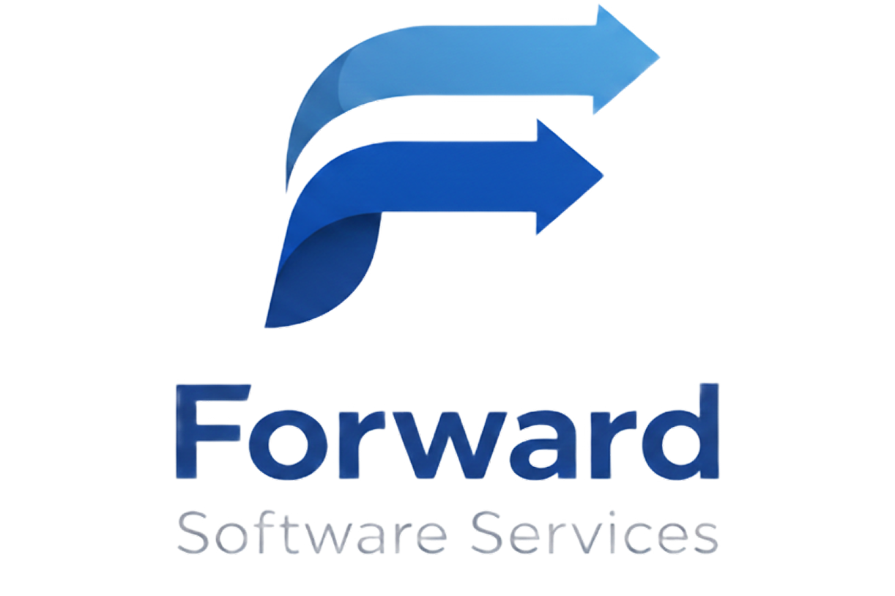

# AI Compliance Report Assistant (POC)



This project began as TinaBot, an AI insurance policy chatbot, but has since been repurposed into a proof of concept for a mortgage/financial advisory use case. Instead of chatting with an end user, the application now ingests a batch of client documents and communications (fact finds, emails, statements of advice, etc.) and uses Google's Gemini AI to assess whether an adviser has met their compliance obligations under a structured financial planning process.

Advisers upload the files gathered during a client engagement, and the app extracts the text, analyses it against a defined set of compliance rules, and produces a structured report showing what was met, what was missed, and why — with evidence and remediation guidance.

The original chatbot logic (conversational insurance recommendations) remains in the codebase as a reference/legacy mode but is not the focus of the current POC.

## Features

- 📄 Multi-file upload (PDF, Word, and TXT) of client documents and communications
- Automated text extraction from uploaded documents
- AI-driven compliance analysis using Google's Gemini models
- Rule-by-rule compliance report (pass / fail / partial) with evidence, severity, and remediation steps
- Progress indicator while documents are extracted, analysed, and the report is generated
- Responsive design with custom branding
- Containerised deployment for easy portability

## Compliance Framework

The proof of concept evaluates uploaded documents against the **6-Step Financial Planning Process**:

1. **Establish and Define the Relationship** — scope, responsibilities, compensation, and engagement duration
2. **Gather Client Data and Goals** — personal/financial information and client objectives
3. **Analyse and Evaluate Financial Status** — strengths, weaknesses, and roadblocks
4. **Develop and Present Recommendations** — customised strategies and client understanding
5. **Implement the Plan** — execution of agreed strategies
6. **Monitor and Review the Plan** — ongoing review and adjustment mechanisms

Each rule is scored with a status, supporting evidence quoted from the source documents, a severity rating, and remediation guidance where gaps are found. The rule set lives in `m4-backend/compliance-rules.js` and can be edited to fit a different advisory framework.

## Tech Stack

### Frontend

- **React.js** - UI library
- **Tailwind CSS with DaisyUI** - Styling framework
- **ReactMarkdown** - For message/report formatting
- **Custom styling** - With brand colors

### Backend

- **Node.js with Express** - API server
- **Google Generative AI SDK** - Interface with Gemini AI
- **Multer** - File upload handling
- **pdf-parse / mammoth** - Text extraction from PDF and Word documents
- **Custom compliance rules & prompts** - For the 6-step financial planning framework

### DevOps

- **Docker** - For containerization
- **Docker Compose** - For orchestration
- **Nginx** - For serving frontend and API proxying

## Getting Started

### Prerequisites

- Docker and Docker Compose installed
- Google Gemini API key

### Installation

1. Clone the repository

   ```bash
   git clone https://github.com/AndyGuffey/TinaBot-Mission-04.git
   cd TinaBot-Mission-04
   ```

2. Create a `.env` file in the root directory with your Gemini API key

   ```
   GEMINI_API_KEY=your-gemini-api-key-here
   ```

3. Build and start the containers

   ```bash
   docker-compose up --build
   ```

4. Access the application at http://localhost

5. Upload one or more client documents and click "Analyse Documents" to generate a compliance report.

## Project Structure

```
mission-04/
├── docker-compose.yml         # Docker Compose configuration
├── m4-frontend/                # React frontend application
│   ├── Dockerfile              # Frontend Docker configuration
│   ├── nginx.conf              # Nginx configuration for serving and proxying
│   └── src/
│       ├── App.jsx             # Main application component (upload → progress → report flow)
│       └── components/
│           ├── FileUploader.jsx      # Document upload UI
│           ├── ProgressIndicator.jsx # Extraction/analysis progress display
│           ├── ComplianceReport.jsx  # Renders the generated compliance report
│           └── Footer.jsx            # Branding footer
└── m4-backend/                 # Node.js backend application
    ├── Dockerfile               # Backend Docker configuration
    ├── server.js                # Express server: upload, chat, and analyze endpoints
    ├── fileExtractor.js         # Extracts text from PDF/Word/TXT uploads
    ├── compliance-rules.js      # 6-Step Financial Planning Process rule definitions
    └── prompt.js                # System prompts (compliance analysis + legacy chatbot)
```

## Development

### Running in Development Mode

For development without Docker:

1. Start the backend

   ```bash
   cd m4-backend
   npm install
   npm run dev
   ```

2. Start the frontend in a separate terminal

   ```bash
   cd m4-frontend
   npm install
   npm run dev
   ```

3. Access the development server at http://localhost:5173

### API Endpoints

- `POST /api/upload` - Accepts multipart file uploads (`documents` field) and returns extracted text per document
- `POST /api/analyze` - Accepts extracted document text and returns a structured compliance report
- `POST /api/chat` - Legacy conversational endpoint retained from the original insurance chatbot POC

### Modifying the Compliance Rules

The compliance framework can be customised by editing `m4-backend/compliance-rules.js`. Each rule defines an ID, the step it belongs to, severity, a description, and the key elements the AI looks for as evidence:

```javascript
{
  id: "FP-001",
  step: 1,
  name: "Relationship Establishment",
  category: "Foundation",
  severity: "critical",
  description: "Documents must clearly outline the scope of services, responsibilities, compensation, and engagement duration",
  keyElements: [
    "Scope of services defined",
    "Client and planner responsibilities clearly stated",
    "Compensation structure documented",
    "Engagement duration specified",
  ],
  applicableTo: ["all"],
}
```

### Modifying the System Prompts

The AI's analysis behaviour is driven by the prompts in `m4-backend/prompt.js`, including the `compliance` prompt used for document analysis:

```javascript
module.exports = {
  compliance: `You are a financial planning compliance auditor specializing in
  the 6-Step Financial Planning Process. Your role is to analyze client planning
  documents and assess their compliance with this structured approach...`,

  // Additional prompts, including the legacy insurance chatbot prompt...
};
```

## Additional Information

### Architecture Details

The application follows a modern microservices architecture:

- Frontend container serves the React application via Nginx
- Backend container runs the Node.js Express server
- Communication between services is handled via Docker networking
- API requests are proxied through Nginx to the backend
- Uploaded documents are processed in memory (not persisted to disk) and sent to Gemini for analysis

### Deployment Options

#### Production Deployment

For production deployment, consider:

- Using a container orchestration platform like Kubernetes
- Setting up CI/CD pipelines for automated deployment
- Implementing proper logging and monitoring
- Using a reverse proxy like Traefik or Nginx Ingress

#### Cloud Deployment

The containerized application can be easily deployed to:

- AWS ECS or EKS
- Google Cloud Run or GKE
- Azure Container Instances or AKS

## Troubleshooting

- **API Key Issues**: Ensure your Gemini API key is correctly set in the `.env` file
- **Container Communication**: If services can't communicate, check the Nginx configuration
- **Port Conflicts**: Make sure ports 80 and 3000 are not in use by other applications
- **Upload Errors**: Only PDF, Word (.doc/.docx), and TXT files up to 25MB per file are accepted

## License

© 2026 Forward Software Services. All rights reserved.

This project was developed by Andy Guffey as a freelance engagement. All source code, designs, and associated documentation are proprietary and remain the intellectual property of Forward Software Services. No part of this project may be reproduced, distributed, or used to create derivative works without prior written permission.

## Acknowledgments

- Google Gemini AI for providing the language model capabilities
- React and Vite teams for frontend tooling
- Docker for simplifying deployment and environment consistency
